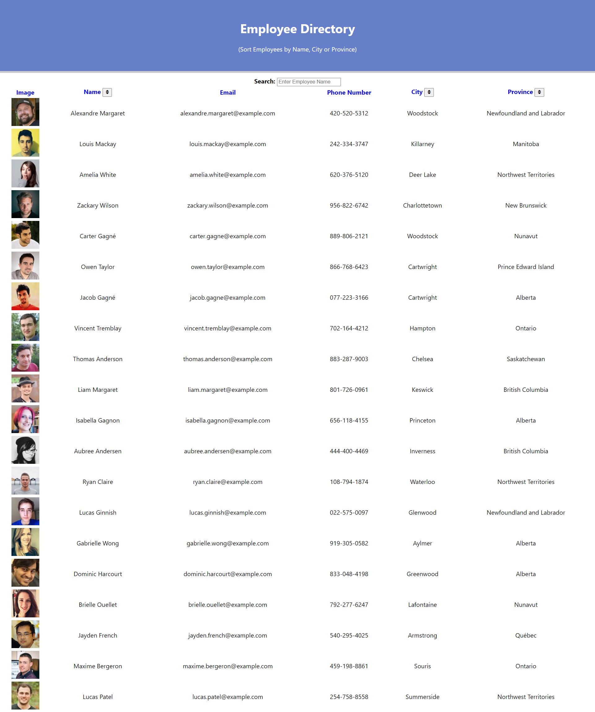

# Employee Directory

 
 
 
 
 

## Table of Contents
* [Description](#description)
* [Technology](#technology)
* [Usage](#usage)
  * [Deployment](#deployment)
  * [Screenshot](#screenshot)
* [Screenshots](#screenshots)
* [Credits](#credits)
* [Contact](#contact)
* [License](#license)

## Description
This application is an employee directory made with React. The user is able to view my entire employee directory at once so that I have quick access to their information. An API was used in this project to get random users. As an employee or manager you can benefit greatly from being able to view non-sensitive data about other employees. It would be particularly helpful to be able to filter employees by name.

## Technology
[Node.js](https://nodejs.org/en/)

[React](https://reactjs.org/)

## Usage
The user is able to Search for employees by first name as well as filter employees by the first letter of their names. The user is able to sort the employee name, city or province in acsending or descending order. 

### Deployment

Click [Employee Directory](https://nashwalters.github.io/empl-directory/) to deploy application.

### Screenshot

## Credits
* [Adam Simonini](https://github.com/adamsimonini)

## Contact
If you have any questions, I can be reached via:
* <bold>Email</bold>: nash.walters@outlook.com

## License 
Copyright © 2021 Nash Walters
